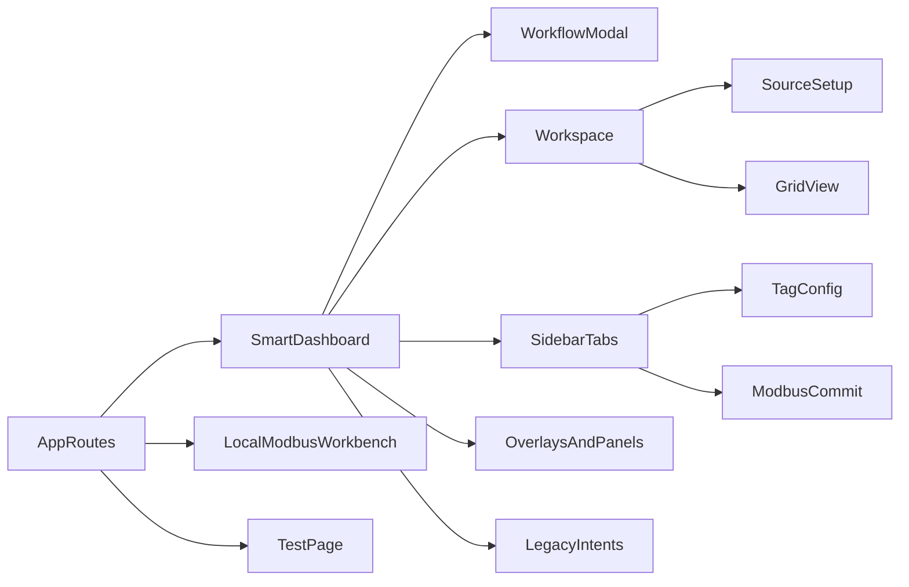

# UI/UX 全面檢視與收斂方案

## 目前判斷

目前真正與你的產品目標直接相關的，是 `SmartDashboard` 與 `LocalModbusWorkbench` 兩條主線；`TestPage` 是工程測試工具，應保留但不應主導產品資訊架構。

- `SmartDashboard` 應被收斂成單人可快速操作的主工作流。核心檔案包含 [frontend/src/pages/datalink/SmartDashboardPage.tsx](frontend/src/pages/datalink/SmartDashboardPage.tsx)、[frontend/src/pages/datalink/smart-dashboard/SmartDashboardSidebar.tsx](frontend/src/pages/datalink/smart-dashboard/SmartDashboardSidebar.tsx)、[frontend/src/pages/datalink/smart-dashboard/SmartDashboardWorkspaceContent.tsx](frontend/src/pages/datalink/smart-dashboard/SmartDashboardWorkspaceContent.tsx)、[frontend/src/pages/datalink/smart-dashboard/SmartDashboardWorkflowModal.tsx](frontend/src/pages/datalink/smart-dashboard/SmartDashboardWorkflowModal.tsx)。
- `LocalModbusWorkbench` 是 Tag 對應本地 Modbus 的後段工作台，應與 `SmartDashboard` 形成清楚接力，而不是另一套獨立心智模型。核心檔案包含 [frontend/src/pages/datalink/LocalModbusWorkbenchPage.tsx](frontend/src/pages/datalink/LocalModbusWorkbenchPage.tsx)。
- `TestPage` 是你專用的測試工具，定位維持工程工具即可，只需與主產品共用設計語言。核心檔案包含 [frontend/src/pages/TestPage.tsx](frontend/src/pages/TestPage.tsx)。
- `Gateway` 相關頁面暫不作為本輪主線，只保留必要的一致性收斂，不讓它分散主流程改造資源。

## 主要問題

### 1. 資訊架構與任務流

- `SmartDashboard` 把設備管理、來源規劃、記憶體格、Tag 綁定、Modbus、提交都塞在同一工作區，對新手心智負擔過高。
- `SmartDashboardWorkflowModal` 混合「設備管理中心」與多種 intent 導流，modal 的責任過重。
- `SmartDashboardSidebar` 用 `plan/tag/modbus/commit` 四分頁承載主要流程，對熟手有效，但缺乏明確的新手任務導引。
- `LocalModbusWorkbenchPage` 與 `SmartDashboard` 的接力點不夠直觀，使用者不容易理解什麼時候該切到本地 Modbus 映射。
- `TestPage` 是工程工具，應與主產品導流分離，只保留風格一致，不再承擔主流程。

### 2. Legacy 相容層與未使用設計仍混在主流程旁

- 目前 datalink 真正被路由直接渲染的頁面，幾乎只剩 [frontend/src/pages/datalink/SmartDashboard.tsx](frontend/src/pages/datalink/SmartDashboard.tsx) 與 [frontend/src/pages/datalink/LocalModbusWorkbenchPage.tsx](frontend/src/pages/datalink/LocalModbusWorkbenchPage.tsx)。
- `SmartDashboard` 雖然對外看似單頁，但內部其實是 `Header + Notices + ControlBar + Workspace + WorkflowModal + Overlays + Panels + GridOverlays` 的複合殼層，不是單純單畫面。
- 可高信心列入裁剪候選的檔案包含 [frontend/src/layouts/DatalinkLayout.tsx](frontend/src/layouts/DatalinkLayout.tsx)、[frontend/src/pages/datalink/smart-dashboard/SmartDashboardSidebarTools.tsx](frontend/src/pages/datalink/smart-dashboard/SmartDashboardSidebarTools.tsx)、[frontend/src/pages/datalink/smart-dashboard/SmartDashboardTagAndModbusPanel.tsx](frontend/src/pages/datalink/smart-dashboard/SmartDashboardTagAndModbusPanel.tsx)。
- 相容路由與 intent 仍偏多，例如 [frontend/src/features/datalink/legacyRoutes.ts](frontend/src/features/datalink/legacyRoutes.ts) 與 [frontend/src/App.tsx](frontend/src/App.tsx) 中的 `/datalink/points`、`/datalink/mappings`、`/datalink/wizard`、`/datalink/settings` 等 redirect。

### 3. 設計系統未成為單一可信來源

- 有 theme 與共用 UI 基底，但 token 沒有真正被全專案統一消費。關鍵檔案包含 [frontend/src/index.css](frontend/src/index.css)、[frontend/src/contexts/ThemeContext.tsx](frontend/src/contexts/ThemeContext.tsx)、[frontend/src/components/Layout.tsx](frontend/src/components/Layout.tsx)、[frontend/src/styles/tokens.ts](frontend/src/styles/tokens.ts)、[frontend/src/pages/gateway/styleTokens.ts](frontend/src/pages/gateway/styleTokens.ts)、[frontend/src/components/ui/button.tsx](frontend/src/components/ui/button.tsx)。
- 大量按鈕、表單、卡片樣式仍直接手寫 Tailwind class，導致各頁細節不一致。
- `Layout`、`DatalinkLayout`、`Gateway` 頁面殼層風格相近但未收斂為同一套 shell primitive。

### 4. 測試策略尚未成為 UI 改動前提

- 目前已有部分 `SmartDashboard` 與 `LocalModbusWorkbench` 測試，但不足以支撐大規模 UI 收斂。
- 依你的要求，後續必須改為 TDD 先行：先補主要互動測試，再進行任何 UI 重構。
- `TestPage` 既然是你專用工具，更應先由測試保護其行為，再只做樣式收斂。

### 5. 可近用性與一致性規範不足

根據最新 [Vercel Web Interface Guidelines](https://raw.githubusercontent.com/vercel-labs/web-interface-guidelines/main/command.md) 對照後，主要風險如下：

- 多數 focus ring 有補上，但不少輸入與按鈕仍使用 `focus:outline-none` + 局部替代，焦點可見性強弱不一。
- 表單普遍缺少統一的 `name`、`autocomplete`、`inputmode` 策略，尤其是 [frontend/src/pages/gateway/GatewayQuickSetupPage.tsx](frontend/src/pages/gateway/GatewayQuickSetupPage.tsx) 與 [frontend/src/pages/datalink/LocalModbusWorkbenchPage.tsx](frontend/src/pages/datalink/LocalModbusWorkbenchPage.tsx)。
- 文案仍混用 `...` 與 `…`，例如 loading / submit 狀態；錯誤訊息多偏描述問題，較少直接指引下一步。
- 多處使用 `transition-all` 或大範圍 transition 類別，動畫規則未系統化。
- 緊湊型工具列與固定欄寬在窄螢幕下容易擁擠，特別是 [frontend/src/pages/datalink/smart-dashboard/SmartDashboardWorkspaceContent.tsx](frontend/src/pages/datalink/smart-dashboard/SmartDashboardWorkspaceContent.tsx)。

## 盤查結論

- `SmartDashboard` 不是只有畫面上看到的單一頁，而是單一路由下包了大量現役 panel、overlay、modal 與 legacy intent 相容層的複合殼層。
- 是，現在仍混有舊索引與未使用設計。
- 高信心未使用或可裁剪候選：
  [frontend/src/layouts/DatalinkLayout.tsx](frontend/src/layouts/DatalinkLayout.tsx)
  [frontend/src/pages/datalink/smart-dashboard/SmartDashboardSidebarTools.tsx](frontend/src/pages/datalink/smart-dashboard/SmartDashboardSidebarTools.tsx)
  [frontend/src/pages/datalink/smart-dashboard/SmartDashboardTagAndModbusPanel.tsx](frontend/src/pages/datalink/smart-dashboard/SmartDashboardTagAndModbusPanel.tsx)
- 中信心可簡化候選：
  [frontend/src/pages/datalink/SmartDashboard.tsx](frontend/src/pages/datalink/SmartDashboard.tsx)
  [frontend/src/features/datalink/legacyRoutes.ts](frontend/src/features/datalink/legacyRoutes.ts)
  [frontend/src/App.tsx](frontend/src/App.tsx) 內多條舊 datalink redirect

## 建議方向

### 方案 A：先補測試與風格一致化，再重構主流程

- 先為主流程補測試，再收斂 token、按鈕、表單、狀態訊息與 focus 規則。
- 優點：風險低、能保護既有功能，且 `TestPage` 可先安全統一外觀。
- 缺點：`SmartDashboard` 的根本任務複雜度仍在。

### 方案 B：先裁剪 legacy 與重整 `SmartDashboard` 任務流，再回頭補設計系統

- 先清掉未使用殘留，並把設備管理、來源規劃、Tag/Modbus/Commit 流程拆出清楚層次。
- 優點：能直接對準你的核心工作流。
- 缺點：若測試不先補齊，回歸風險高。

### 方案 C：以 TDD 為前提，分段收斂主流程

- Phase 1 先盤點 legacy 並補主流程測試。
- Phase 2 重整 `SmartDashboard` 核心流程。
- Phase 3 收斂 `LocalModbusWorkbench` 與 `TestPage` 風格。
- Phase 4 再做可近用性與響應式驗證。
- 這是最符合你目前目標的路線，也是本次建議採用的方案。

## 建議採用的分階段改善方案

## 文件記錄規範

本次任務正式採用 `planning-with-files` 工作法。開始執行前與執行過程中，必須在專案根目錄維持以下三份持久化文件：

- `task_plan.md`
  用於記錄階段、狀態、決策、待辦與錯誤。
- `findings.md`
  用於記錄盤查結果、研究發現、legacy 清單、UI/UX 問題與設計判斷。
- `progress.md`
  用於記錄每次工作階段、測試結果、已修改檔案與驗證紀錄。

執行時必須遵守以下紀律：

- 開始前先做 session catchup，確認是否有前次未同步脈絡。
- 每次進入新階段前，先重讀 `task_plan.md` 與必要的 `findings.md`。
- 每完成一個 phase，立即更新 `task_plan.md` 狀態與 `progress.md`。
- 每有重要發現，立即寫入 `findings.md`，不能只留在對話上下文。
- 每個錯誤都要記錄在 `task_plan.md` 或 `progress.md`，不能無聲重試。
- 若同一問題連續失敗三次，必須停下來整理已嘗試的方法，再回報使用者。

### Phase 1：盤查 legacy 並建立 TDD 基線

目標是先確認哪些現役、哪些可刪，並用測試把主流程保護起來。

- 執行起點必須先跑 `planning-with-files` 的 session catchup 流程。
- 在專案根目錄建立 `task_plan.md`、`findings.md`、`progress.md` 三份文件，作為本次任務的正式記錄。
- 盤查 `SmartDashboard` 現役 render 鏈、舊 redirect、未引用元件與半退休 state。
- 建立主流程測試基線，至少覆蓋：
  `選設備`
  `規劃來源`
  `格子顯示/選取`
  `Tag 設定`
  `前往 Local Modbus Workbench`
  `TestPage` 核心互動不變
- 先不做大規模刪除，以「可安全刪除清單 / 可觀察後再刪清單 / 必留現役清單」管理。

### Phase 2：建立最小 UI 規範底座

目標是讓核心頁面先共用同一套視覺與互動基準。

- 將 UI 規範、色彩/元件決策與文案規範同步寫入 `findings.md`，避免後續實作偏移。
- 收斂共用按鈕、輸入框、badge、section header、panel shell，優先以 [frontend/src/components/ui/button.tsx](frontend/src/components/ui/button.tsx) 與現有 `components/ui/*` 為基礎擴充。
- 整理 [frontend/src/index.css](frontend/src/index.css)、[frontend/src/styles/tokens.ts](frontend/src/styles/tokens.ts)、[frontend/src/pages/gateway/styleTokens.ts](frontend/src/pages/gateway/styleTokens.ts)，定義單一色彩、間距、圓角、陰影與 typography scale。
- 建立表單規範：欄位 label、placeholder、錯誤訊息、成功訊息、disabled/loading 樣式、`autocomplete/name/inputmode` 原則。
- 建立 microcopy 規範：統一使用繁中語氣、`…`、按鈕命名與狀態回饋語氣。

### Phase 3：重整 `SmartDashboard` 核心流程

目標是把目前複合殼層調整成符合你使用方式的單人主工作流。

- 每完成一段流程調整，都要在 `progress.md` 記錄對應測試、修改檔案與風險。
- 重新定義唯一主線：`建立/選擇資料來源 -> 在格子上看到資料 -> 設定 Tag -> 對應本地 Modbus -> 確認資料進資料庫供其他 UI 使用`。
- 將 `WorkflowModal` 收斂為設備入口，不再承擔過多 legacy intent。
- 將 `Sidebar` 改為配合主流程的輕量 stage panel，而不是四個並列專家分頁。
- 將 `WorkspaceContent` 聚焦在「資料來源設定 + 格子可視化」，把進階操作延後或收折。
- 將資料庫與本地 Modbus 的去向說明做清楚，避免使用者只看到 Tag/Commit 卻不知道最終輸出目的。

### Phase 4：整理 `LocalModbusWorkbench` 與 `TestPage`

目標是工具頁不搶主產品心智，但仍維持同一產品語言。

- `TestPage` 的樣式收斂與保留行為邊界，必須在 `findings.md` 與 `progress.md` 清楚記錄。
- `LocalModbusWorkbenchPage` 依「系統狀態 / Mapping 編輯 / 衝突治理 / 寫入測試」重整區塊層級，減少工程面板感。
- `TestPage` 保持工程工具定位，只做外觀與互動語言一致化，不改你既有測試用途。

### Phase 5：可近用性、響應式與品質驗證

- 針對主要互動頁補做鍵盤導覽、focus order、screen reader label、aria-live 與 reduced motion 驗證。
- 針對小尺寸螢幕重新檢視 toolbar、側欄、sticky panel、固定寬欄位與 overflow 行為。
- 建立最少一套 UI regression / interaction test，覆蓋 `SmartDashboard`、`LocalModbusWorkbench` 與 `TestPage`。
- 驗證結果必須完整寫入 `progress.md`，並在 `task_plan.md` 勾稽每個 phase 的完成狀態。

## 預期產出

- 一份 legacy 盤查結果：現役清單、可刪清單、相容層收斂順序。
- 一份簡潔的 UI 規範草案：token、表單、按鈕、狀態與文案規則。
- 一份 `SmartDashboard` 新資訊架構與任務流草圖，明確對應你的單人操作主線。
- 一份以 TDD 為前提的改造清單：先測試、再收斂風格、再重整主流程。
- 一套完整的工作記錄：`task_plan.md`、`findings.md`、`progress.md`。

## 驗收標準

- `SmartDashboard` 能讓單人快速完成資料來源設定、格子檢視、Tag 設定與 Local Modbus 對應。
- 使用者能清楚理解資料會流向本地 Modbus 與資料庫，供另一個 UI 專案取用。
- `TestPage` 保持專用測試用途，但外觀與互動語言與主產品一致。
- 所有 UI 改動皆有對應測試，並採 TDD 先行。
- 主要頁面符合基礎可近用性與窄螢幕可操作要求。
