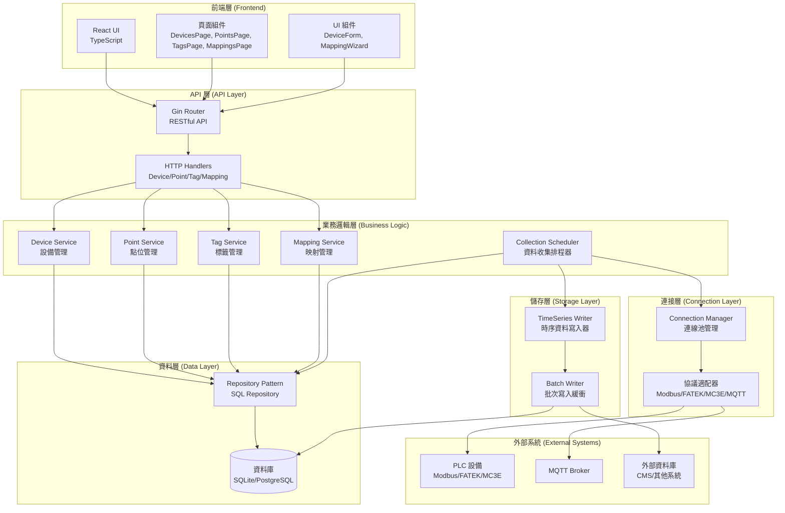
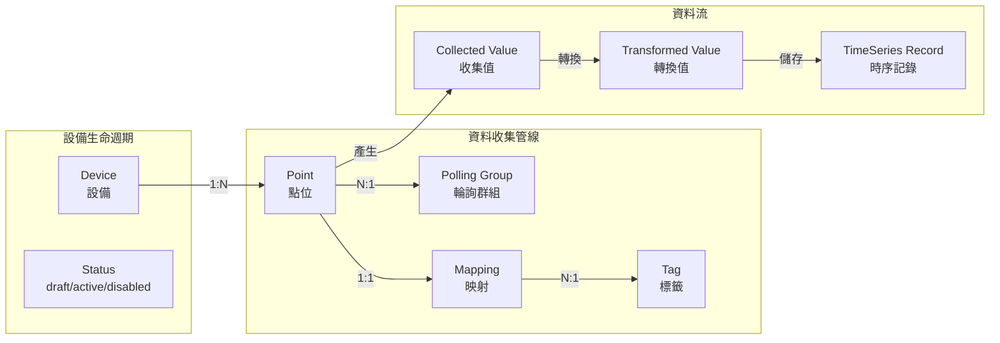
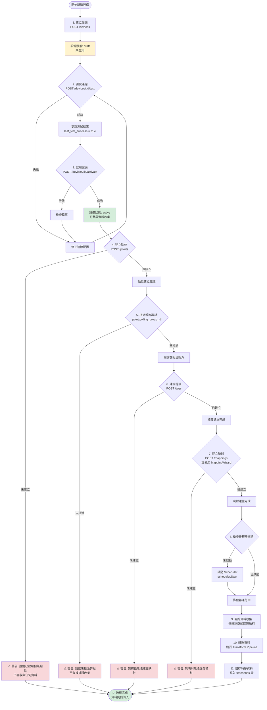
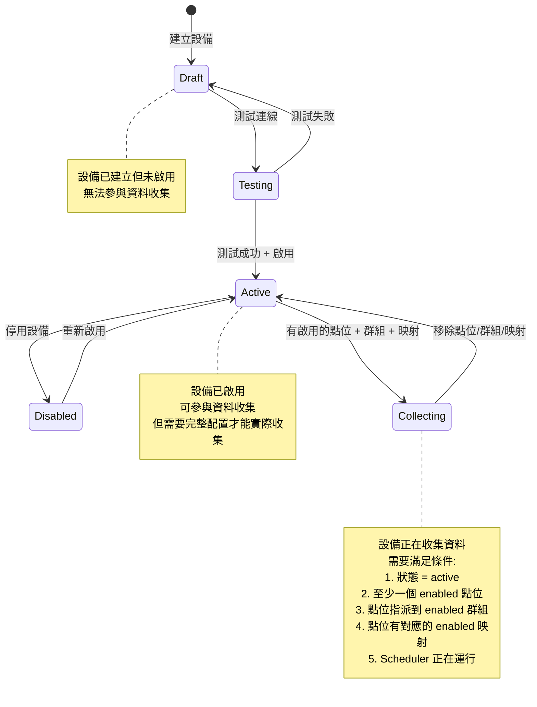
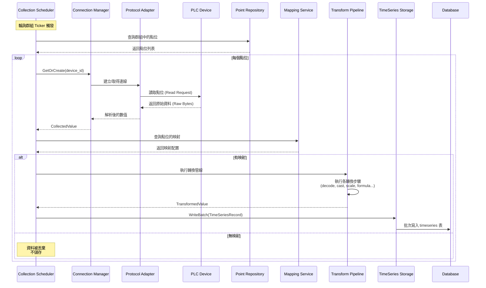
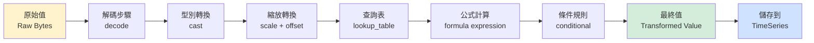

# Go Gateway 專案架構與流程深度分析

## 目錄
1. [系統架構圖](#系統架構圖)
2. [新增設備完整流程](#新增設備完整流程)
3. [資料流向圖](#資料流向圖)
4. [流程缺失分析](#流程缺失分析)
5. [改進建議](#改進建議)

---

## 系統架構圖

### 整體架構



### 核心模組關係



---

## 新增設備完整流程

### 完整工作流程圖



### 狀態轉換圖



---

## 資料流向圖

### 資料收集與處理流程



### 映射轉換流程



---

## 流程缺失分析

### 1. 缺少明確的引導流程

**問題描述：**
- 新增設備後，系統沒有明確指引下一步該做什麼
- 使用者不知道需要完成哪些步驟才能開始收集資料
- 缺少「快速開始」或「設定精靈」功能

**影響：**
- 使用者可能啟用設備後就停止，不知道還需要建立點位、標籤、映射
- 導致設備處於 active 狀態但實際上沒有收集任何資料

**證據：**
- `DeviceForm` 只有基本的設備建立功能
- 沒有「下一步建議」或「完成度檢查」
- `DevicesPage` 沒有顯示設備的「配置完成度」

### 2. 缺少狀態驗證與檢查

**問題描述：**
- 設備啟用時只檢查連線，不檢查是否有點位、群組、映射
- 沒有「就緒檢查」(Readiness Check) 機制
- 缺少配置完整性驗證

**影響：**
- 設備可能處於 active 狀態但無法實際收集資料
- 使用者不知道缺少哪些配置

**證據：**
```go
// internal/datalink/device/service.go:214
func (s *Service) Activate(ctx context.Context, id string) error {
    // 只檢查連線，不檢查點位、群組、映射
    if err := s.TestConnection(ctx, id); err != nil {
        return fmt.Errorf("連線測試失敗，無法啟用設備: %w", err)
    }
    // ...
}
```

### 3. 缺少自動化建議

**問題描述：**
- 沒有根據設備類型自動建議點位配置
- 沒有根據協議類型提供預設配置模板
- 缺少「一鍵設定」功能

**影響：**
- 使用者需要手動輸入所有配置，容易出錯
- 新手使用者不知道如何開始

### 4. 缺少即時狀態反饋

**問題描述：**
- 設備啟用後，沒有即時顯示「是否正在收集資料」
- 沒有「最後收集時間」或「收集統計」資訊
- 缺少資料流狀態監控

**影響：**
- 使用者無法確認設備是否正常運作
- 無法快速發現配置問題

**證據：**
- `Device` 模型沒有 `last_collected_at` 欄位
- `DevicesPage` 沒有顯示收集狀態

### 5. 缺少錯誤處理與恢復機制

**問題描述：**
- 資料收集失敗時，沒有自動重試機制（雖然 Scheduler 有重試，但缺少更高層的恢復）
- 連線中斷後，缺少自動恢復策略
- 沒有錯誤通知機制

**影響：**
- 長時間的連線問題可能導致資料遺失
- 使用者無法及時發現問題

### 6. 缺少批次操作支援

**問題描述：**
- 無法批次建立多個點位
- 無法批次建立映射
- 缺少「從模板匯入」功能

**影響：**
- 大量設備配置時效率低下
- 重複性工作增加

### 7. 缺少配置驗證與預覽

**問題描述：**
- 建立映射時缺少「測試映射」功能（雖然有 preview，但缺少在建立前的驗證）
- 沒有「配置影響分析」（例如：修改群組間隔會影響哪些點位）

**影響：**
- 配置錯誤可能導致資料收集異常
- 無法預先評估配置變更的影響

---

## 改進建議

### 優先級 P0（立即實施）

#### 1. 新增設備配置完成度檢查

**實施方案：**
- 在 `Device` 模型中新增 `readiness_status` 欄位
- 實作 `DeviceService.CheckReadiness()` 方法，檢查：
  - ✅ 設備狀態 = active
  - ✅ 至少一個 enabled 點位
  - ✅ 點位指派到 enabled 群組
  - ✅ 點位有對應的 enabled 映射
  - ✅ Scheduler 正在運行

**API 端點：**
```go
GET /api/v1/datalink/devices/:id/readiness
Response: {
    "ready": bool,
    "checks": {
        "device_active": bool,
        "has_points": bool,
        "has_polling_groups": bool,
        "has_mappings": bool,
        "scheduler_running": bool
    },
    "missing": []string,  // 缺少的配置項目
    "suggestions": []string  // 建議的下一步操作
}
```

**前端顯示：**
- 在 `DeviceCard` 中顯示完成度進度條
- 顯示缺少的配置項目清單
- 提供「快速完成配置」按鈕

#### 2. 新增設備後引導流程

**實施方案：**
- 建立 `DeviceOnboardingWizard` 組件
- 步驟：
  1. 建立設備 ✅
  2. 測試連線 → 啟用設備
  3. 建立點位（可批次）
  4. 指派輪詢群組
  5. 建立標籤（可批次）
  6. 建立映射（使用現有 MappingWizard）
  7. 確認開始收集

**UI 流程：**
```typescript
// 新增設備成功後，自動開啟引導流程
const handleCreateSuccess = (device: Device) => {
    showOnboardingWizard(device.id);
};
```

#### 3. 設備狀態儀表板

**實施方案：**
- 新增 `DeviceStatusDashboard` 頁面
- 顯示：
  - 設備總數、啟用數、收集中數
  - 每個設備的收集狀態（最後收集時間、收集次數、錯誤次數）
  - 配置完成度統計

**資料模型擴充：**
```sql
ALTER TABLE devices ADD COLUMN last_collected_at TIMESTAMPTZ;
ALTER TABLE devices ADD COLUMN collection_count BIGINT DEFAULT 0;
ALTER TABLE devices ADD COLUMN error_count BIGINT DEFAULT 0;
```

### 優先級 P1（短期實施）

#### 4. 配置模板與批次匯入

**實施方案：**
- 建立「設備配置模板」功能
- 支援 JSON/YAML 格式的批次匯入
- 提供常見設備類型的預設模板

**API 端點：**
```go
POST /api/v1/datalink/devices/:id/apply-template
POST /api/v1/datalink/devices/batch-import
GET /api/v1/datalink/templates
```

#### 5. 即時資料流監控

**實施方案：**
- 使用 WebSocket 或 SSE 推送即時收集狀態
- 顯示每個設備的即時資料流
- 提供「資料流預覽」功能

**API 端點：**
```go
GET /api/v1/datalink/devices/:id/stream  // SSE
GET /api/v1/datalink/devices/:id/stats  // 統計資訊
```

#### 6. 配置驗證與影響分析

**實施方案：**
- 建立 `ConfigValidator` 服務
- 在修改配置前進行驗證
- 顯示配置變更的影響範圍

**API 端點：**
```go
POST /api/v1/datalink/config/validate
POST /api/v1/datalink/config/impact-analysis
```

### 優先級 P2（中期實施）

#### 7. 自動化配置建議

**實施方案：**
- 根據設備協議類型自動建議點位配置
- 使用機器學習或規則引擎提供配置建議
- 提供「一鍵完成配置」功能

#### 8. 錯誤恢復與通知機制

**實施方案：**
- 實作更完善的錯誤恢復策略
- 新增錯誤通知系統（Email/Webhook）
- 提供錯誤日誌查詢與分析

#### 9. 配置版本管理

**實施方案：**
- 實作配置版本控制
- 支援配置回滾
- 提供配置變更歷史記錄

---

## 實施路線圖

### 階段一：基礎改進（1-2 週）
1. ✅ 實作設備配置完成度檢查
2. ✅ 新增設備後引導流程
3. ✅ 設備狀態儀表板

### 階段二：增強功能（2-3 週）
4. ✅ 配置模板與批次匯入
5. ✅ 即時資料流監控
6. ✅ 配置驗證與影響分析

### 階段三：進階功能（3-4 週）
7. ✅ 自動化配置建議
8. ✅ 錯誤恢復與通知機制
9. ✅ 配置版本管理

---

## 總結

### 當前狀態
- ✅ 核心功能完整：設備、點位、標籤、映射、收集都已實作
- ⚠️ 缺少使用者引導：新增設備後不知道下一步
- ⚠️ 缺少狀態驗證：無法確認配置是否完整
- ⚠️ 缺少即時反饋：無法監控資料收集狀態

### 關鍵改進點
1. **引導流程**：新增設備後自動引導完成所有必要配置
2. **狀態檢查**：實作配置完成度檢查，明確顯示缺少的項目
3. **即時監控**：提供資料收集狀態的即時反饋
4. **批次操作**：支援批次建立點位、標籤、映射，提升效率

### 預期效果
- 📈 使用者體驗提升：明確的引導流程，減少配置錯誤
- 📈 系統可靠性提升：配置驗證與狀態檢查，減少運行時錯誤
- 📈 運維效率提升：即時監控與批次操作，減少人工干預
