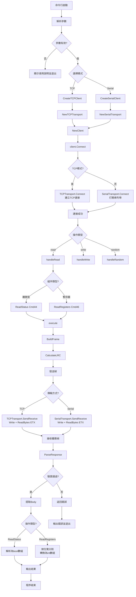
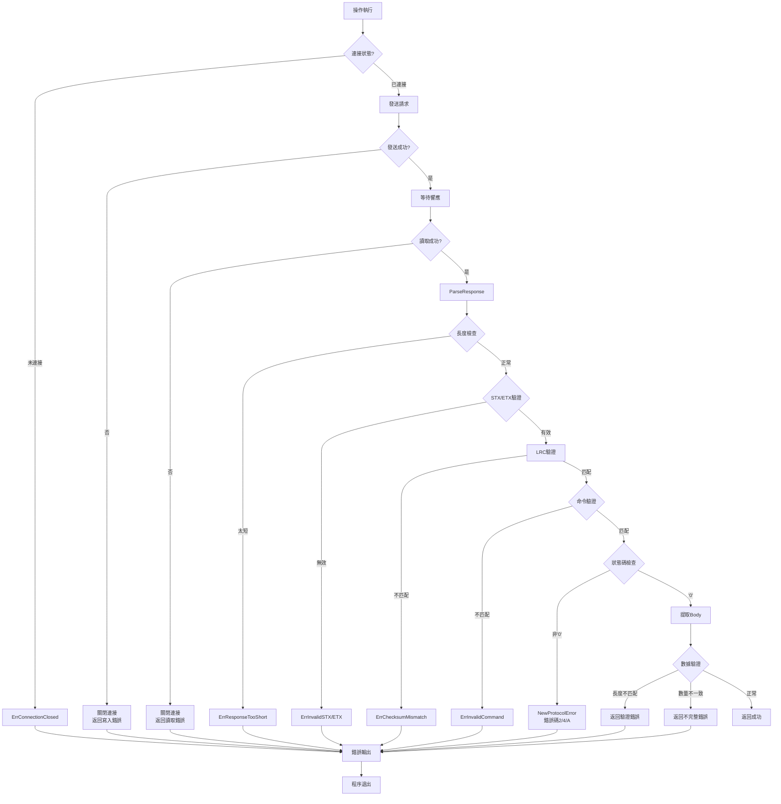
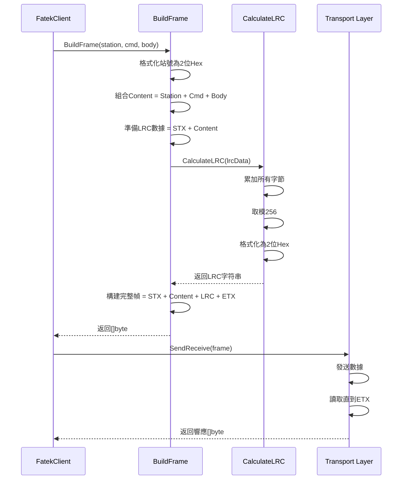

# Fatek PLC Gateway 技術分析文件

## A. 系統概覽 (System Overview)

### 核心功能

本專案是一個 **Fatek PLC 通訊協議的 Go 語言實現**，提供命令行測試工具，支援透過 TCP/IP 或串列埠（Serial）與 Fatek PLC 進行通訊。系統實現了 Fatek ASCII 協議的核心命令，包括讀取/寫入離散狀態（Discrete Status）、讀取/寫入暫存器（Registers），以及混合隨機讀取（Random Read）功能。

### 解決的問題

1. **協議封裝**：將複雜的 Fatek ASCII 協議封裝為易用的 Go API
2. **多傳輸支援**：統一抽象 TCP 和 Serial 兩種通訊方式
3. **地址管理**：自動處理不同組件類型（X, Y, M, S, T, C, R, D 等）的地址格式化
4. **錯誤處理**：完整的錯誤分類和處理機制
5. **線程安全**：使用 mutex 確保並發安全

### 核心資料結構

#### 1. FatekClient (`client.go`)

```go
type FatekClient struct {
    transport Transport  // 底層傳輸層（TCP 或 Serial）
    station   int        // PLC 站號（0-255）
    mu        sync.Mutex // 互斥鎖，確保線程安全
}
```

**狀態管理**：維護與 PLC 的連接狀態，所有操作通過 `mu` 互斥鎖保護，確保同一時間只有一個操作執行。

#### 2. ComponentType (`address.go`)

```go
type ComponentType struct {
    Name      string  // 組件符號（如 "X", "D", "R"）
    Width     int     // 位寬（1, 16, 32 bits）
    IsDiscrete bool   // 是否為離散型（1-bit）
    FormatLen int     // 地址字符串長度（5, 6, 7）
}
```

**用途**：定義不同 PLC 組件的屬性，用於地址格式化和數據解析。

#### 3. Transport Interface (`transport.go`)

```go
type Transport interface {
    Connect() error
    Close() error
    SendReceive(data []byte) ([]byte, error)
}
```

**抽象層**：統一 TCP 和 Serial 兩種傳輸方式的接口，實現策略模式。

---

## B. 流程步驟 (Process Flow - Text)

### 主流程（以讀取操作為例）

1. **命令行參數解析** (`main.go:14-51`)

   - 解析 `-mode`, `-host`, `-port`, `-action`, `-symbol`, `-addr`, `-count` 等參數
   - 驗證必填參數（mode, action）
   - 顯示使用說明（如果參數錯誤）

2. **創建客戶端** (`main.go:65-91`)

   - 根據 `-mode` 選擇 TCP 或 Serial 模式
   - TCP: 調用 `fatek.CreateTCPClient()` 創建 TCP 客戶端
   - Serial: 調用 `fatek.CreateSerialClient()` 創建 Serial 客戶端
   - 客戶端內部創建對應的 Transport 實例

3. **建立連接** (`main.go:94-100`)

   - 調用 `client.Connect()`
   - TCP: 建立 TCP Socket 連接，創建 `bufio.Reader`
   - Serial: 打開串列埠，配置波特率、資料位元等參數
   - 設置 `defer client.Close()` 確保程序結束時關閉連接

4. **執行讀取操作** (`main.go:104-108`)

   - 調用 `handleRead(client, symbol, addr, count)`
   - 驗證 `symbol` 參數
   - 調用 `fatek.GetComponentType()` 獲取組件類型信息

5. **判斷組件類型** (`main.go:139-169`)

   - 如果 `comp.IsDiscrete == true`：調用 `client.ReadStatus()` 讀取離散狀態
   - 如果 `comp.IsDiscrete == false`：調用 `client.ReadRegisters()` 讀取暫存器

6. **構建協議幀** (`client.go:69-72` 或 `134-137`)

   - 將 `count` 轉換為 2 位十六進制字符串（`IntToHex(count, 2)`）
   - 格式化地址字符串（`FormatAddress(comp, startAddr)`）
   - 組合 Body: `countHex + addrStr`

7. **執行命令** (`client.go:38-53`)

   - 調用 `c.execute(cmd, body)`
   - 獲取互斥鎖（`c.mu.Lock()`）
   - 調用 `BuildFrame(c.station, cmd, body)` 構建完整協議幀
   - 調用 `transport.SendReceive(req)` 發送請求並接收響應
   - 調用 `ParseResponse(resp, cmd)` 解析響應
   - 釋放互斥鎖（`defer c.mu.Unlock()`）

8. **構建協議幀** (`frame.go:19-43`)

   - 將站號轉換為 2 位十六進制（`fmt.Sprintf("%02X", station)`）
   - 組合內容：`stationStr + cmd + body`
   - 計算 LRC 校驗和：`STX + Content` 的所有字節求和，取模 256
   - 構建完整幀：`STX + Content + LRC + ETX`

9. **發送和接收** (`transport.go:56-89` 或 `177-200`)

   - **TCP**: 設置連接超時，寫入數據到 Socket，使用 `bufio.Reader.ReadBytes(ETX)` 讀取直到遇到 ETX
   - **Serial**: 設置讀取超時，寫入數據到串列埠，使用 `bufio.Reader.ReadBytes(ETX)` 讀取直到遇到 ETX
   - 如果發生錯誤，自動關閉連接以重置狀態

10. **解析響應** (`frame.go:46-116`)

    - 驗證最小長度（正常 9 字節，Loopback 8 字節）
    - 驗證 STX 和 ETX
    - 驗證 LRC 校驗和
    - 提取命令碼，驗證是否與預期一致
    - 檢查狀態碼（'0' 表示成功，其他為錯誤碼）
    - 提取 Body 數據

11. **解析數據** (`client.go:79-83` 或 `143-168`)

    - **離散狀態**：將每個字符轉換為 bool（'1' = true, '0' = false）
    - **暫存器**：按位寬分割字符串（16-bit = 4 字符，32-bit = 8 字符），將十六進制字符串轉換為整數
    - 驗證數據長度和數量是否與請求一致

12. **輸出結果** (`main.go:146-153` 或 `161-168`)
    - 格式化輸出讀取結果
    - 程序正常退出

### 錯誤處理流程

1. **連接錯誤**：顯示錯誤信息，程序退出（`os.Exit(1)`）
2. **協議錯誤**：返回 `ProtocolError`，包含錯誤碼和命令信息
3. **通訊錯誤**：返回 `ErrConnectionClosed` 或 `ErrTimeout`，自動關閉連接
4. **數據驗證錯誤**：返回具體的驗證失敗原因（長度不匹配、地址超出範圍等）

---

## C. 函式說明 (Function Details)

### 檔案：`cmd/fatek_test/main.go`

| 函式名稱       | 行數    | 運作邏輯                                                                                                                                                                                                                                                                                                                                                                                                                                                                                                                                 | 關聯性                                                                                                                                   | I/O 參數                                                                                                    |
| -------------- | ------- | ---------------------------------------------------------------------------------------------------------------------------------------------------------------------------------------------------------------------------------------------------------------------------------------------------------------------------------------------------------------------------------------------------------------------------------------------------------------------------------------------------------------------------------------- | ---------------------------------------------------------------------------------------------------------------------------------------- | ----------------------------------------------------------------------------------------------------------- |
| `main`         | 14-126  | **1. 參數解析階段**：使用 `flag` 包解析所有命令行參數，包括模式（TCP/Serial）、主機地址、端口、操作類型、組件符號、地址、數量等。**2. 參數驗證**：檢查必填參數（mode, action），如果缺失則顯示使用說明並退出。**3. 客戶端創建**：根據模式調用對應的工廠函數創建客戶端實例。**4. 連接建立**：調用 `client.Connect()` 建立與 PLC 的連接，設置 defer 確保程序結束時關閉。**5. 操作分發**：根據 action 參數調用對應的處理函數（handleRead/handleWrite/handleRandom）。**6. 錯誤處理**：所有錯誤都會輸出到 stderr 並以非零狀態碼退出。        | 調用：`fatek.CreateTCPClient`, `fatek.CreateSerialClient`, `client.Connect`, `client.Close`, `handleRead`, `handleWrite`, `handleRandom` | **輸入**：命令行參數（通過 flag 解析）<br>**輸出**：無（直接退出）                                          |
| `handleRead`   | 128-172 | **1. 參數驗證**：檢查 symbol 是否為空。**2. 組件類型獲取**：調用 `fatek.GetComponentType()` 獲取組件類型信息，如果無效則返回錯誤。**3. 類型判斷**：根據 `comp.IsDiscrete` 判斷是離散型還是暫存器型。**4. 離散型讀取**：調用 `client.ReadStatus()` 讀取離散狀態，返回 `[]bool`，然後格式化輸出結果。**5. 暫存器讀取**：調用 `client.ReadRegisters()` 讀取暫存器，返回 `[]int`，然後格式化輸出結果。**6. 結果格式化**：將結果數組格式化為 `[val1, val2, ...]` 的形式輸出。                                                                 | 調用：`fatek.GetComponentType`, `client.ReadStatus`, `client.ReadRegisters`<br>被調用：`main`                                            | **輸入**：`client *fatek.FatekClient`, `symbol string`, `addr int`, `count int`<br>**輸出**：`error`        |
| `handleWrite`  | 174-230 | **1. 參數驗證**：檢查 symbol 和 values 是否為空。**2. 組件類型獲取**：調用 `fatek.GetComponentType()` 獲取組件類型。**3. 值解析**：將逗號分隔的字符串分割為數組，根據組件類型解析為 `[]bool`（離散型）或 `[]int`（暫存器型）。**4. 布林值解析**：使用 `strconv.ParseBool()` 將字符串轉換為 bool，支持 "true"/"false" 字符串。**5. 整數值解析**：使用 `strconv.Atoi()` 將字符串轉換為 int。**6. 寫入操作**：根據組件類型調用 `client.WriteStatus()` 或 `client.WriteRegisters()`。**7. 結果輸出**：顯示寫入的地址範圍和值，確認寫入成功。 | 調用：`fatek.GetComponentType`, `strconv.ParseBool`, `strconv.Atoi`, `client.WriteStatus`, `client.WriteRegisters`<br>被調用：`main`     | **輸入**：`client *fatek.FatekClient`, `symbol string`, `addr int`, `valuesStr string`<br>**輸出**：`error` |
| `handleRandom` | 232-280 | **1. 參數驗證**：檢查 random 字符串是否為空。**2. 字符串解析**：將 `"SYMBOL1:ADDR1,SYMBOL2:ADDR2"` 格式的字符串分割為多個項目。**3. 項目解析**：對每個項目，使用 `strings.LastIndex()` 找到最後一個冒號位置，分割出符號和地址。**4. 地址轉換**：使用 `strconv.Atoi()` 將地址字符串轉換為整數。**5. 構建項目列表**：創建 `[]fatek.RandomReadItem` 數組。**6. 執行隨機讀取**：調用 `client.ReadRandom()` 執行混合讀取。**7. 結果輸出**：遍歷結果 map，以 `SymbolAddr = value` 的格式輸出每個項目的結果。                                   | 調用：`strings.Split`, `strings.LastIndex`, `strconv.Atoi`, `client.ReadRandom`<br>被調用：`main`                                        | **輸入**：`client *fatek.FatekClient`, `randomStr string`<br>**輸出**：`error`                              |

### 檔案：`internal/protocol/fatek/client.go`

| 函式名稱         | 行數    | 運作邏輯                                                                                                                                                                                                                                                                                                                                                                                                                                                                                                                                                                                                                                              | 關聯性                                                                                                                                                                                              | I/O 參數                                                                             |
| ---------------- | ------- | ----------------------------------------------------------------------------------------------------------------------------------------------------------------------------------------------------------------------------------------------------------------------------------------------------------------------------------------------------------------------------------------------------------------------------------------------------------------------------------------------------------------------------------------------------------------------------------------------------------------------------------------------------- | --------------------------------------------------------------------------------------------------------------------------------------------------------------------------------------------------- | ------------------------------------------------------------------------------------ |
| `NewClient`      | 15-23   | **1. 站號默認值處理**：如果 station 為 0，設置為 `DefaultStation`（默認值 1）。**2. 結構體初始化**：創建 `FatekClient` 實例，設置 transport 和 station 字段，初始化互斥鎖（零值即可）。**3. 返回實例**：返回指向新創建的客戶端的指針。                                                                                                                                                                                                                                                                                                                                                                                                                | 被調用：`CreateTCPClient`, `CreateSerialClient`                                                                                                                                                     | **輸入**：`transport Transport`, `station int`<br>**輸出**：`*FatekClient`           |
| `Connect`        | 25-29   | **1. 獲取鎖**：調用 `c.mu.Lock()` 獲取互斥鎖，確保線程安全。**2. 委派連接**：調用底層 `transport.Connect()` 方法建立連接。**3. 釋放鎖**：使用 `defer c.mu.Unlock()` 確保函數返回時釋放鎖。**4. 錯誤傳遞**：如果連接失敗，直接返回錯誤。                                                                                                                                                                                                                                                                                                                                                                                                               | 調用：`transport.Connect`<br>被調用：`main`                                                                                                                                                         | **輸入**：無（接收者方法）<br>**輸出**：`error`                                      |
| `Close`          | 31-35   | **1. 獲取鎖**：獲取互斥鎖確保線程安全。**2. 委派關閉**：調用底層 `transport.Close()` 方法關閉連接。**3. 釋放鎖**：使用 defer 釋放鎖。                                                                                                                                                                                                                                                                                                                                                                                                                                                                                                                 | 調用：`transport.Close`<br>被調用：`main`（通過 defer）                                                                                                                                             | **輸入**：無（接收者方法）<br>**輸出**：`error`                                      |
| `execute`        | 37-53   | **核心執行引擎**：**1. 線程安全保護**：獲取互斥鎖，確保同一時間只有一個操作執行。**2. 構建協議幀**：調用 `BuildFrame(c.station, cmd, body)` 構建完整的 ASCII 協議幀，包括 STX、站號、命令、Body、LRC、ETX。**3. 發送和接收**：調用 `transport.SendReceive(req)` 發送請求幀並接收響應幀。如果發生錯誤（超時、連接中斷等），直接返回錯誤。**4. 解析響應**：調用 `ParseResponse(resp, cmd)` 解析響應幀，驗證 LRC、提取 Body、檢查狀態碼。如果狀態碼不是 '0'，會返回 `ProtocolError`。**5. 返回結果**：返回解析後的 Body 字符串或錯誤。                                                                                                                   | 調用：`BuildFrame`, `transport.SendReceive`, `ParseResponse`<br>被調用：`ReadStatus`, `WriteStatus`, `ReadRegisters`, `WriteRegisters`, `ReadRandom`, `LoopbackTest`, `Run`, `Stop`, `SingleAction` | **輸入**：`cmd string`, `body string`<br>**輸出**：`string, error`                   |
| `ReadStatus`     | 55-84   | **命令 44：連續讀取離散狀態**：**1. 數量驗證**：檢查 count 是否超過 255（協議限制）。**2. 組件類型驗證**：獲取組件類型，驗證必須是離散型（IsDiscrete == true）。**3. 構建請求 Body**：將 count 轉換為 2 位十六進制（如 "0A"），格式化地址字符串（如 "X00010"），組合為 `countHex + addrStr`。**4. 執行命令**：調用 `execute("44", body)` 發送請求。**5. 解析響應**：響應 Body 是連續的 '0' 或 '1' 字符，每個字符代表一個離散點的狀態。遍歷字符串，將 '1' 轉換為 true，'0' 轉換為 false，構建 `[]bool` 數組返回。                                                                                                                                      | 調用：`GetComponentType`, `IntToHex`, `FormatAddress`, `execute`<br>被調用：`handleRead`                                                                                                            | **輸入**：`symbol string`, `startAddr int`, `count int`<br>**輸出**：`[]bool, error` |
| `WriteStatus`    | 86-116  | **命令 45：連續寫入離散狀態**：**1. 數量驗證**：檢查數據長度是否超過 255。**2. 組件類型驗證**：驗證必須是離散型。**3. 構建請求 Body**：將 count 轉換為十六進制，格式化地址，然後將 `[]bool` 數組轉換為字符串（true -> '1', false -> '0'），組合為 `countHex + addrStr + dataString`。**4. 執行命令**：調用 `execute("45", body)` 發送請求。**5. 響應處理**：寫入命令成功時響應 Body 為空，只需檢查錯誤。                                                                                                                                                                                                                                              | 調用：`GetComponentType`, `IntToHex`, `FormatAddress`, `execute`<br>被調用：`handleWrite`                                                                                                           | **輸入**：`symbol string`, `startAddr int`, `data []bool`<br>**輸出**：`error`       |
| `ReadRegisters`  | 118-169 | **命令 46：連續讀取暫存器**：**1. 組件類型獲取**：獲取組件類型信息，用於判斷位寬（16-bit 或 32-bit）。**2. 數量限制檢查**：16-bit 暫存器最多 64 個，32-bit 暫存器最多 32 個。**3. 構建請求 Body**：`countHex + addrStr`（與 ReadStatus 類似）。**4. 執行命令**：調用 `execute("46", body)`。**5. 數據長度驗證**：計算預期長度（16-bit = count _ 4 字符，32-bit = count _ 8 字符），驗證響應長度是否匹配。**6. 數據解析**：按位寬分割響應字符串，每個值為 4 或 8 個十六進制字符，使用 `HexToInt()` 轉換為整數。**7. 數量驗證**：確保解析出的值數量與請求的 count 一致。                                                                                | 調用：`GetComponentType`, `IntToHex`, `FormatAddress`, `execute`, `HexToInt`<br>被調用：`handleRead`                                                                                                | **輸入**：`symbol string`, `startAddr int`, `count int`<br>**輸出**：`[]int, error`  |
| `WriteRegisters` | 171-203 | **命令 47：連續寫入暫存器**：**1. 組件類型獲取和數量限制檢查**：與 ReadRegisters 相同。**2. 數據轉換**：將 `[]int` 數組中的每個值轉換為十六進制字符串。**3. 位寬遮罩處理**：使用 `uint64` 進行位運算，確保值不超過組件的位寬範圍（16-bit: 0-65535, 32-bit: 0-4294967295）。計算遮罩 `(1 << width) - 1`，然後與值進行 AND 運算。**4. 十六進制格式化**：使用 `IntToHex()` 將遮罩後的值格式化為固定寬度的十六進制字符串（16-bit: 4 字符，32-bit: 8 字符）。**5. 構建請求 Body**：`countHex + addrStr + dataHexString`。**6. 執行命令**：調用 `execute("47", body)`。                                                                                     | 調用：`GetComponentType`, `IntToHex`, `FormatAddress`, `execute`<br>被調用：`handleWrite`                                                                                                           | **輸入**：`symbol string`, `startAddr int`, `data []int`<br>**輸出**：`error`        |
| `ReadRandom`     | 210-285 | **命令 48：混合隨機讀取**：**1. 數量限制檢查**：最多 64 個項目。**2. 構建請求 Body**：將項目數量轉換為 2 位十六進制，然後遍歷每個項目，獲取組件類型，驗證地址範圍（D: 0-4999, R: 0-4167, 其他: 0-9999），格式化地址字符串，追加到 Body。最終 Body 格式：`countHex + addr1 + addr2 + ...`。**3. 執行命令**：調用 `execute("48", body)`。**4. 混合響應解析**：響應 Body 是混合格式，離散型返回 1 個字符（'0' 或 '1'），暫存器返回 4 或 8 個十六進制字符。使用指針 `ptr` 追蹤當前解析位置，根據每個項目的組件類型決定讀取長度，解析後移動指針。**5. 構建結果 Map**：以 `"SymbolAddr"` 為 key，值為 `bool` 或 `int`，構建 `map[string]interface{}` 返回。 | 調用：`GetComponentType`, `IntToHex`, `FormatAddress`, `execute`, `HexToInt`<br>被調用：`handleRandom`                                                                                              | **輸入**：`items []RandomReadItem`<br>**輸出**：`map[string]interface{}, error`      |

### 檔案：`internal/protocol/fatek/frame.go`

| 函式名稱        | 行數    | 運作邏輯                                                                                                                                                                                                                                                                                                                                                                                                                                                                                                                                                                                                                                                                                                                                                                                                                                   | 關聯性                                                                               | I/O 參數                                                                       |
| --------------- | ------- | ------------------------------------------------------------------------------------------------------------------------------------------------------------------------------------------------------------------------------------------------------------------------------------------------------------------------------------------------------------------------------------------------------------------------------------------------------------------------------------------------------------------------------------------------------------------------------------------------------------------------------------------------------------------------------------------------------------------------------------------------------------------------------------------------------------------------------------------ | ------------------------------------------------------------------------------------ | ------------------------------------------------------------------------------ |
| `CalculateLRC`  | 9-15    | **LRC 校驗和計算**：**1. 初始化累加器**：`sum` 變數初始化為 0（byte 類型）。**2. 字節累加**：遍歷 `data` 數組中的每個字節，累加到 `sum`。**3. 取模運算**：由於是 byte 類型，自動進行模 256 運算（溢出自動處理）。**4. 格式化輸出**：使用 `fmt.Sprintf("%02X", sum)` 將結果格式化為 2 位大寫十六進制字符串（如 "C7"）。**注意**：LRC 計算包含 STX 字節（0x02）。                                                                                                                                                                                                                                                                                                                                                                                                                                                                            | 被調用：`BuildFrame`, `ParseResponse`                                                | **輸入**：`data []byte`<br>**輸出**：`string`                                  |
| `BuildFrame`    | 19-43   | **協議幀構建**：**1. 站號格式化**：將站號（int）格式化為 2 位大寫十六進制字符串（如 1 -> "01"）。**2. 內容組合**：組合 `stationStr + cmd + body` 形成內容部分。**3. LRC 數據準備**：創建字節數組，先追加 STX（0x02），再追加內容的字節表示。**4. LRC 計算**：調用 `CalculateLRC()` 計算校驗和。**5. 完整幀構建**：構建最終幀：`STX + Content + LRC + ETX`，返回 `[]byte`。**幀結構**：`[0x02] [Station(2)] [Cmd(2)] [Body(...)] [LRC(2)] [0x03]`                                                                                                                                                                                                                                                                                                                                                                                           | 調用：`CalculateLRC`<br>被調用：`execute`                                            | **輸入**：`station int`, `cmd string`, `body string`<br>**輸出**：`[]byte`     |
| `ParseResponse` | 46-116  | **響應幀解析**：**1. 最小長度檢查**：正常響應至少 9 字節（STX + Station + Cmd + Status + LRC + ETX），Loopback 命令（4E）至少 8 字節（無 Status）。**2. 幀標記驗證**：檢查第一個字節是否為 STX（0x02），最後一個字節是否為 ETX（0x03）。**3. LRC 驗證**：提取響應中的 LRC（倒數第 3、4 個字節），計算實際 LRC（從 STX 到 LRC 之前的所有字節），比較是否一致。如果不一致，返回 `ErrChecksumMismatch`。**4. 命令提取和驗證**：從索引 [3:5] 提取命令碼，與預期的 `expectedCmd` 比較。**5. Loopback 特殊處理**：如果命令是 "4E"，響應格式不同（無 Status 碼），Body 從索引 5 開始到 LRC 之前。**6. 狀態碼檢查**：正常響應的狀態碼在索引 5，'0' 表示成功，其他字符（'2', '4', 'A' 等）表示協議錯誤，返回 `ProtocolError`。**7. Body 提取**：從索引 6 開始到 LRC 之前（倒數第 3 個字節）提取 Body。如果響應長度為 9（僅 Ack），Body 為空字符串。 | 調用：`CalculateLRC`, `NewProtocolError`<br>被調用：`execute`                        | **輸入**：`response []byte`, `expectedCmd string`<br>**輸出**：`string, error` |
| `HexToInt`      | 119-126 | **十六進制字符串轉整數**：使用 `fmt.Sscanf()` 將十六進制字符串解析為 int。支持標準的十六進制格式（可選前綴 "0x"）。如果解析失敗，返回錯誤。                                                                                                                                                                                                                                                                                                                                                                                                                                                                                                                                                                                                                                                                                                | 被調用：`ReadRegisters`, `ReadRandom`                                                | **輸入**：`hexStr string`<br>**輸出**：`int, error`                            |
| `IntToHex`      | 129-132 | **整數轉十六進制字符串**：**1. 格式字符串構建**：根據 `width` 參數構建格式字符串，如 width=2 則為 `"%02X"`（2 位，補零，大寫）。**2. 格式化**：使用 `fmt.Sprintf()` 將整數格式化為固定寬度的十六進制字符串，自動補零。                                                                                                                                                                                                                                                                                                                                                                                                                                                                                                                                                                                                                     | 被調用：`ReadStatus`, `WriteStatus`, `ReadRegisters`, `WriteRegisters`, `ReadRandom` | **輸入**：`val int`, `width int`<br>**輸出**：`string`                         |

### 檔案：`internal/protocol/fatek/transport.go`

| 函式名稱                      | 行數    | 運作邏輯                                                                                                                                                                                                                                                                                                                                                                                                                                                                                                                                               | 關聯性                                                                                      | I/O 參數                                                                                                                                          |
| ----------------------------- | ------- | ------------------------------------------------------------------------------------------------------------------------------------------------------------------------------------------------------------------------------------------------------------------------------------------------------------------------------------------------------------------------------------------------------------------------------------------------------------------------------------------------------------------------------------------------------ | ------------------------------------------------------------------------------------------- | ------------------------------------------------------------------------------------------------------------------------------------------------- |
| `NewTCPTransport`             | 27-33   | **TCP 傳輸實例創建**：創建 `TCPTransport` 結構體，設置 Host、Port，Timeout 默認為 2 秒。不立即建立連接，連接在 `Connect()` 時建立。                                                                                                                                                                                                                                                                                                                                                                                                                    | 被調用：`CreateTCPClient`                                                                   | **輸入**：`host string`, `port int`<br>**輸出**：`*TCPTransport`                                                                                  |
| `TCPTransport.Connect`        | 35-44   | **TCP 連接建立**：**1. 地址構建**：組合 `host:port` 格式的地址字符串。**2. 超時連接**：使用 `net.DialTimeout()` 建立 TCP 連接，使用配置的 Timeout。**3. 讀取器創建**：創建 `bufio.Reader` 用於緩衝讀取，提高讀取效率。**4. 狀態保存**：將連接和讀取器保存到結構體字段中。                                                                                                                                                                                                                                                                              | 調用：`net.DialTimeout`, `bufio.NewReader`<br>被調用：`FatekClient.Connect`                 | **輸入**：無（接收者方法）<br>**輸出**：`error`                                                                                                   |
| `TCPTransport.Close`          | 46-54   | **TCP 連接關閉**：關閉 TCP 連接，將 `conn` 和 `reader` 設置為 nil，重置狀態。                                                                                                                                                                                                                                                                                                                                                                                                                                                                          | 被調用：`FatekClient.Close`, `SendReceive`（錯誤時）                                        | **輸入**：無（接收者方法）<br>**輸出**：`error`                                                                                                   |
| `TCPTransport.SendReceive`    | 56-89   | **TCP 發送接收**：**1. 連接檢查**：檢查連接是否為 nil，如果為 nil 返回 `ErrConnectionClosed`。**2. 超時設置**：設置連接的讀寫超時為當前時間 + Timeout。**3. 數據發送**：調用 `conn.Write()` 發送完整的協議幀。如果寫入失敗，關閉連接並返回錯誤。**4. 響應讀取**：使用 `reader.ReadBytes(ETX)` 讀取數據直到遇到 ETX（0x03）字節。這個方法會阻塞直到讀到 ETX 或發生錯誤（超時、連接中斷等）。**5. 錯誤處理**：如果讀取失敗（超時、連接中斷等），自動關閉連接以重置狀態，防止後續操作使用無效連接。**6. 返回響應**：返回完整的響應幀（包含 STX 到 ETX）。 | 調用：`conn.Write`, `reader.ReadBytes`, `Close`<br>被調用：`execute`                        | **輸入**：`data []byte`<br>**輸出**：`[]byte, error`                                                                                              |
| `NewSerialTransport`          | 104-147 | **Serial 傳輸實例創建**：**1. 默認值處理**：如果參數為 0 或空，設置默認值（波特率 9600，資料位元 7，停止位元 1，同位 E，超時 1 秒）。**2. Parity 轉換**：將字符串（'N'/'E'/'O'）轉換為 `serial.Parity` 枚舉值。**3. StopBits 轉換**：將整數（1/2）轉換為 `serial.StopBits` 枚舉值。**4. 結構體初始化**：創建 `SerialTransport` 實例，保存所有配置參數。不立即打開串列埠。                                                                                                                                                                              | 被調用：`CreateSerialClient`                                                                | **輸入**：`port string`, `baudRate int`, `dataBits int`, `stopBits int`, `parity string`, `timeout time.Duration`<br>**輸出**：`*SerialTransport` |
| `SerialTransport.Connect`     | 149-165 | **Serial 連接建立**：**1. 模式配置**：創建 `serial.Mode` 結構體，設置波特率、資料位元、同位、停止位元。**2. 打開串列埠**：調用 `serial.Open()` 打開指定的串列埠（如 "COM3" 或 "/dev/ttyUSB0"）。**3. 讀取器創建**：創建 `bufio.Reader` 用於緩衝讀取。**4. 狀態保存**：將打開的串列埠和讀取器保存到結構體字段中。                                                                                                                                                                                                                                       | 調用：`serial.Open`, `bufio.NewReader`<br>被調用：`FatekClient.Connect`                     | **輸入**：無（接收者方法）<br>**輸出**：`error`                                                                                                   |
| `SerialTransport.Close`       | 167-175 | **Serial 連接關閉**：關閉串列埠，將 `port` 和 `reader` 設置為 nil。                                                                                                                                                                                                                                                                                                                                                                                                                                                                                    | 被調用：`FatekClient.Close`, `SendReceive`（錯誤時）                                        | **輸入**：無（接收者方法）<br>**輸出**：`error`                                                                                                   |
| `SerialTransport.SendReceive` | 177-200 | **Serial 發送接收**：**1. 連接檢查**：檢查串列埠是否為 nil。**2. 讀取超時設置**：調用 `port.SetReadTimeout()` 設置讀取超時。**3. 數據發送**：調用 `port.Write()` 發送協議幀。如果失敗，關閉連接並返回錯誤。**4. 響應讀取**：使用 `reader.ReadBytes(ETX)` 讀取直到遇到 ETX。**5. 錯誤處理**：讀取失敗時關閉連接。**6. 返回響應**：返回完整響應幀。                                                                                                                                                                                                      | 調用：`port.SetReadTimeout`, `port.Write`, `reader.ReadBytes`, `Close`<br>被調用：`execute` | **輸入**：`data []byte`<br>**輸出**：`[]byte, error`                                                                                              |

### 檔案：`internal/protocol/fatek/address.go`

| 函式名稱           | 行數  | 運作邏輯                                                                                                                                                                                                                                                                                                                                                                                  | 關聯性                                                                                                                            | I/O 參數                                                         |
| ------------------ | ----- | ----------------------------------------------------------------------------------------------------------------------------------------------------------------------------------------------------------------------------------------------------------------------------------------------------------------------------------------------------------------------------------------- | --------------------------------------------------------------------------------------------------------------------------------- | ---------------------------------------------------------------- |
| `GetComponentType` | 37-72 | **組件類型解析**：**1. 大小寫轉換**：將輸入的 symbol 轉換為大寫，確保大小寫不敏感。**2. 精確匹配**：使用 switch 語句匹配已知的組件符號（X, Y, M, S, T, C, R, D, RT, RC, F, DR, DD），返回對應的預定義 `ComponentType`。**3. 動態處理**：如果 symbol 以 "D" 開頭但不在精確匹配中（如 "DWM", "DWS"），動態創建 32-bit 暫存器類型，FormatLen 為 7。**4. 錯誤處理**：如果無法識別，返回錯誤。 | 被調用：`ReadStatus`, `WriteStatus`, `ReadRegisters`, `WriteRegisters`, `ReadRandom`, `SingleAction`, `handleRead`, `handleWrite` | **輸入**：`symbol string`<br>**輸出**：`ComponentType, error`    |
| `FormatAddress`    | 75-78 | **地址字符串格式化**：**1. 格式字符串構建**：根據組件的 FormatLen 和 Name 長度，計算需要補零的位數。例如，X 類型 FormatLen=5，Name="X"（長度 1），則需要補 4 位零，格式為 `"%s%04d"`。**2. 格式化**：使用 `fmt.Sprintf()` 將符號和地址組合，自動補零。例如，`FormatAddress(TypeX, 10)` 返回 `"X00010"`，`FormatAddress(TypeD, 110)` 返回 `"D00110"`。                                     | 被調用：`ReadStatus`, `WriteStatus`, `ReadRegisters`, `WriteRegisters`, `ReadRandom`, `SingleAction`                              | **輸入**：`comp ComponentType`, `addr int`<br>**輸出**：`string` |

### 檔案：`internal/protocol/fatek/factory.go`

| 函式名稱             | 行數  | 運作邏輯                                                                                                                                                                                                                                                                                                                                      | 關聯性                                                    | I/O 參數                                                                                                                                                     |
| -------------------- | ----- | --------------------------------------------------------------------------------------------------------------------------------------------------------------------------------------------------------------------------------------------------------------------------------------------------------------------------------------------- | --------------------------------------------------------- | ------------------------------------------------------------------------------------------------------------------------------------------------------------ |
| `CreateTCPClient`    | 36-45 | **TCP 客戶端工廠函數**：**1. 端口默認值處理**：如果 port 為 0，設置為 `DefaultTCPPort`（500）。**2. 創建傳輸層**：調用 `NewTCPTransport()` 創建 TCP 傳輸實例。**3. 超時設置**：如果 timeout > 0，設置傳輸層的超時時間。**4. 創建客戶端**：調用 `NewClient()` 創建 `FatekClient` 實例，傳入傳輸層和站號。**5. 返回實例**：返回配置好的客戶端。 | 調用：`NewTCPTransport`, `NewClient`<br>被調用：`main`    | **輸入**：`host string`, `port int`, `station int`, `timeout time.Duration`<br>**輸出**：`*FatekClient`                                                      |
| `CreateSerialClient` | 18-24 | **Serial 客戶端工廠函數**：**1. Parity 默認值處理**：如果 parity 為空字符串，設置為 "E"（Even Parity）。**2. 創建傳輸層**：調用 `NewSerialTransport()` 創建 Serial 傳輸實例，傳入所有串列埠配置參數。**3. 創建客戶端**：調用 `NewClient()` 創建客戶端實例。**4. 返回實例**：返回配置好的客戶端。                                              | 調用：`NewSerialTransport`, `NewClient`<br>被調用：`main` | **輸入**：`port string`, `station int`, `baudrate int`, `dataBits int`, `stopBits int`, `parity string`, `timeout time.Duration`<br>**輸出**：`*FatekClient` |

---

## D. 流程圖 (Mermaid Visualization)

### 主流程圖（讀取操作）



### 錯誤處理流程圖



### 協議幀構建流程圖



---

## E. 待確認問題 (Open Questions)

### 1. 協議相關

- **問題**：命令 48（混合讀取）在某些 PLC 型號上返回錯誤 4，是否所有 Fatek PLC 都支援此命令？
- **位置**：`client.go:211-285`
- **建議**：查閱 Fatek 官方文檔確認命令 48 的支援範圍和限制條件。

### 2. 地址範圍驗證

- **問題**：地址範圍驗證（D: 0-4999, R: 0-4167）是否適用於所有 Fatek PLC 型號？
- **位置**：`client.go:229-240`
- **建議**：不同型號可能有不同的地址範圍，需要根據實際使用的 PLC 型號調整。

### 3. 32-bit 暫存器處理

- **問題**：對於以 "D" 開頭的符號（如 DWM, DWS），系統自動判斷為 32-bit，但實際使用中是否需要更精確的判斷邏輯？
- **位置**：`address.go:64-69`
- **建議**：確認所有以 "D" 開頭的符號是否都是 32-bit，或需要更詳細的映射表。

### 4. 錯誤恢復機制

- **問題**：當發生通訊錯誤（超時、連接中斷）時，系統會自動關閉連接，但沒有自動重連機制。是否需要實現重試邏輯？
- **位置**：`transport.go:56-89`, `177-200`
- **建議**：根據實際應用場景決定是否需要自動重連功能。

### 5. 並發安全

- **問題**：雖然使用了 mutex 保護，但多個 goroutine 同時操作同一個 `FatekClient` 實例時，是否會導致請求-響應配對錯誤？
- **位置**：`client.go:38-53`
- **建議**：如果需要並發支援，可能需要實現請求隊列或連接池機制。

### 6. 調試輸出

- **問題**：代碼中有註解掉的調試輸出（`frame.go:45`），是否有統一的調試日誌機制？
- **位置**：`client.go:44-45`
- **建議**：考慮使用標準的日誌庫（如 `log` 或 `zap`）實現可配置的調試輸出。

### 7. 配置管理

- **問題**：所有配置參數都通過命令行傳入，是否有配置文件支援的需求？
- **位置**：`main.go:14-32`
- **建議**：如果參數較多或需要保存常用配置，可以考慮支援 YAML/JSON 配置文件。

### 8. 測試覆蓋

- **問題**：是否有單元測試和集成測試？測試覆蓋率如何？
- **位置**：未見測試文件（除 `example_test.go`）
- **建議**：補充單元測試，特別是協議幀構建和解析、地址格式化等核心功能。

### 9. 文檔完整性

- **問題**：`doc.go` 文件內容未見，是否有完整的 API 文檔？
- **位置**：`doc.go`
- **建議**：補充完整的 GoDoc 文檔，包括所有公開函數和類型的說明。

### 10. 依賴管理

- **問題**：`go.bug.st/serial` 依賴在 Windows 上是否需要特殊的編譯標籤或 CGO？
- **位置**：`go.mod`, `transport.go:9`
- **建議**：確認跨平台編譯的兼容性，特別是 Windows/Linux/Mac 的串列埠支援。

---

**文件生成時間**：2026-01-16  
**分析範圍**：`cmd/fatek_test/main.go`, `internal/protocol/fatek/*.go`  
**分析工具**：手動代碼審查 + 流程追蹤
