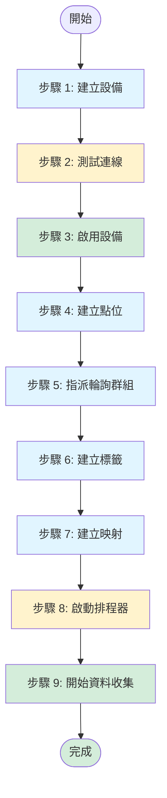
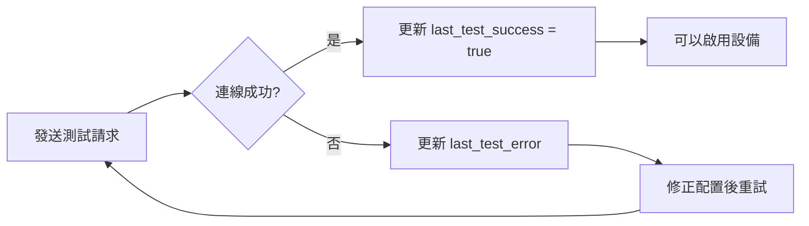
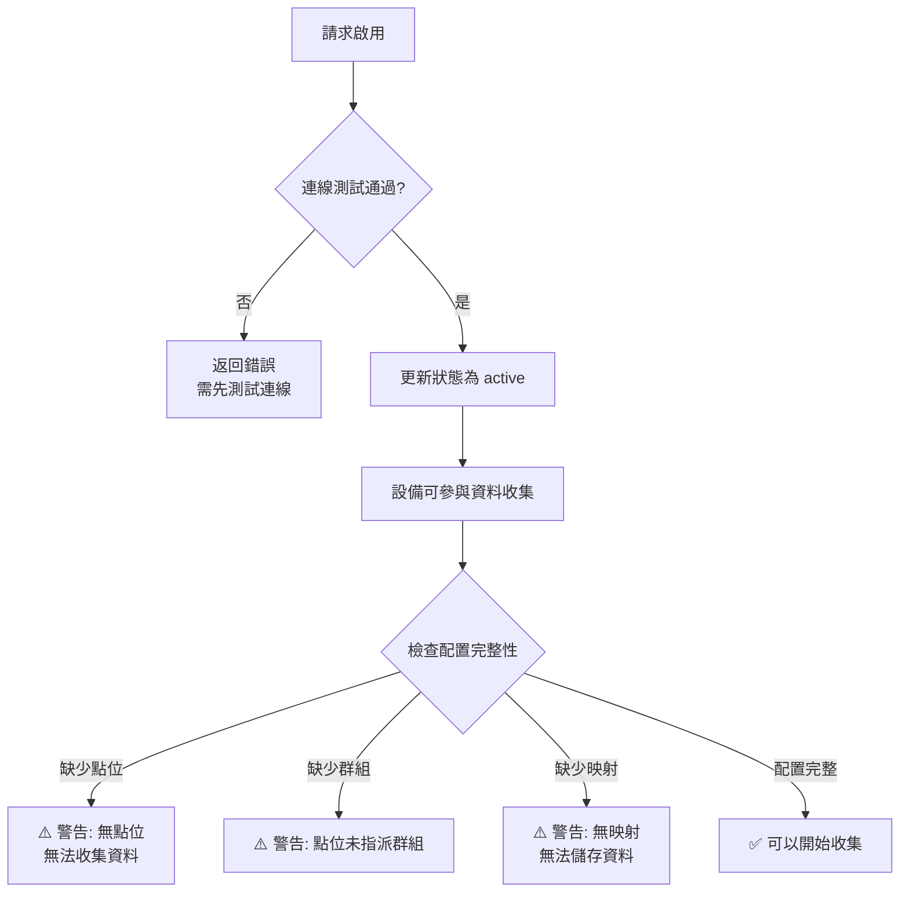
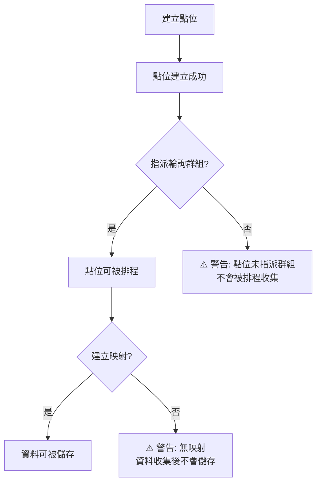
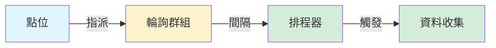
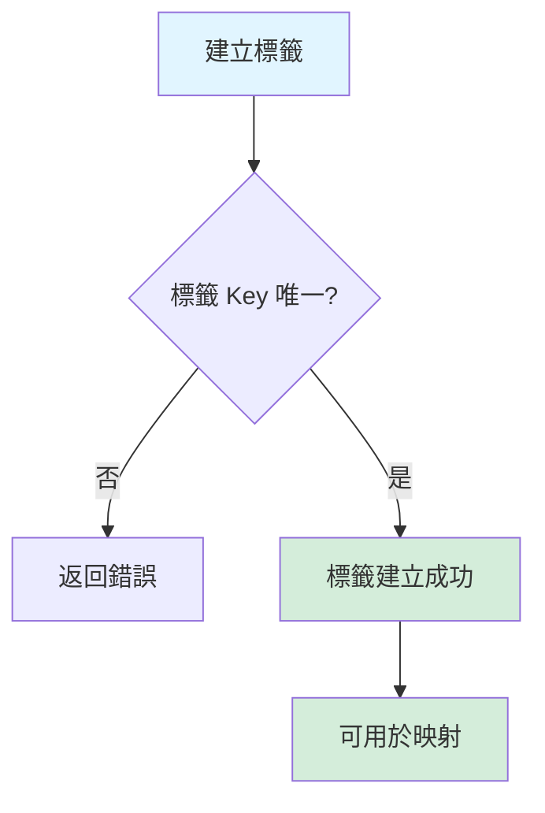
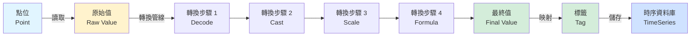
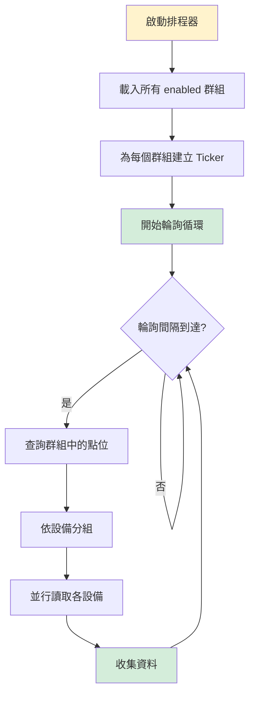
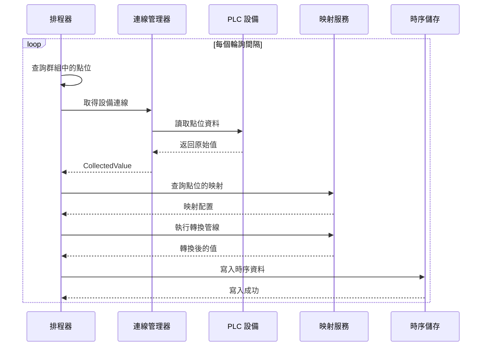

# 新增設備後完整流程指南

## 流程總覽



---

## 詳細步驟說明

### 步驟 1: 建立設備

**操作：** `POST /api/v1/datalink/devices`

**請求範例：**
```json
{
  "name": "PLC-生產線-01",
  "description": "Modbus TCP PLC 設備",
  "protocol": "modbus_tcp",
  "connection_config": {
    "host": "192.168.1.100",
    "port": 502,
    "slave_id": 1,
    "timeout": 5
  }
}
```

**結果：**
- ✅ 設備建立成功
- 📊 狀態：`draft`（草稿）
- ⚠️ **注意**：設備尚未啟用，無法參與資料收集

**下一步：** 測試連線

---

### 步驟 2: 測試連線

**操作：** `POST /api/v1/datalink/devices/:id/test`

**流程：**


**結果：**
- ✅ 連線成功：`last_test_success = true`
- ❌ 連線失敗：`last_test_error = "錯誤訊息"`

**下一步：** 啟用設備（僅在連線成功時）

---

### 步驟 3: 啟用設備

**操作：** `POST /api/v1/datalink/devices/:id/activate`

**流程：**


**結果：**
- ✅ 狀態變更：`draft` → `active`
- ⚠️ **注意**：啟用後仍需完成後續步驟才能實際收集資料

**下一步：** 建立點位

---

### 步驟 4: 建立點位

**操作：** `POST /api/v1/datalink/points`

**請求範例：**
```json
{
  "device_id": "device-uuid",
  "name": "溫度感測器-01",
  "address": "40001",
  "function": "read_holding_registers",
  "data_type": "int16",
  "enabled": true
}
```

**流程：**


**結果：**
- ✅ 點位建立成功
- ⚠️ **注意**：點位必須指派到輪詢群組才會被排程

**下一步：** 指派輪詢群組

---

### 步驟 5: 指派輪詢群組

**操作：** `PUT /api/v1/datalink/points/:id` 或建立點位時指定

**請求範例：**
```json
{
  "polling_group_id": "group-uuid"
}
```

**輪詢群組配置：**
```json
{
  "name": "快速輪詢",
  "interval_ms": 1000,
  "enabled": true
}
```

**流程：**


**結果：**
- ✅ 點位已指派到群組
- ⚠️ **注意**：群組必須 `enabled = true` 才會被排程

**下一步：** 建立標籤

---

### 步驟 6: 建立標籤

**操作：** `POST /api/v1/datalink/tags`

**請求範例：**
```json
{
  "key": "production.line01.temperature",
  "display_name": "生產線01溫度",
  "data_type": "float64",
  "unit": "°C",
  "status": "active"
}
```

**流程：**


**結果：**
- ✅ 標籤建立成功
- ⚠️ **注意**：標籤必須 `status = active` 才能用於映射

**下一步：** 建立映射

---

### 步驟 7: 建立映射

**操作：** `POST /api/v1/datalink/mappings` 或使用 `MappingWizard`

**請求範例：**
```json
{
  "point_id": "point-uuid",
  "tag_id": "tag-uuid",
  "transform_pipeline": [
    {
      "type": "scale",
      "params": {
        "scale": 0.1,
        "offset": 0
      }
    }
  ],
  "enabled": true
}
```

**完整映射流程：**


**結果：**
- ✅ 映射建立成功
- ⚠️ **注意**：映射必須 `enabled = true` 才會執行轉換

**下一步：** 啟動排程器

---

### 步驟 8: 啟動排程器

**操作：** 後端自動啟動或手動啟動

**流程：**


**檢查項目：**
- ✅ Scheduler 是否正在運行：`scheduler.IsRunning()`
- ✅ 是否有 enabled 的輪詢群組
- ✅ 群組中是否有 enabled 的點位
- ✅ 點位是否有對應的 enabled 映射

**結果：**
- ✅ 排程器運行中
- ⚠️ **注意**：只有滿足所有條件的點位才會被收集

**下一步：** 開始資料收集（自動）

---

### 步驟 9: 開始資料收集

**自動流程：**


**監控項目：**
- 📊 最後收集時間：`device.last_collected_at`
- 📊 收集次數：`device.collection_count`
- 📊 錯誤次數：`device.error_count`
- 📊 資料品質：`timeseries.quality`

**結果：**
- ✅ 資料開始流入時序資料庫
- ✅ 可以在 Dashboard 查看即時資料

---

## 完整流程檢查清單

### ✅ 必要步驟（必須完成）

- [ ] **步驟 1**: 建立設備
- [ ] **步驟 2**: 測試連線（必須成功）
- [ ] **步驟 3**: 啟用設備
- [ ] **步驟 4**: 建立至少一個點位
- [ ] **步驟 5**: 將點位指派到輪詢群組
- [ ] **步驟 6**: 建立至少一個標籤
- [ ] **步驟 7**: 建立點位到標籤的映射
- [ ] **步驟 8**: 確認排程器正在運行

### ⚠️ 常見問題檢查

#### 問題 1: 設備已啟用但無資料收集

**可能原因：**
- ❌ 沒有建立點位
- ❌ 點位未指派到輪詢群組
- ❌ 輪詢群組未啟用 (`enabled = false`)
- ❌ 點位未啟用 (`enabled = false`)
- ❌ 排程器未啟動

**檢查方法：**
```sql
-- 檢查設備的點位
SELECT * FROM points WHERE device_id = 'device-uuid' AND enabled = true;

-- 檢查點位的群組
SELECT p.*, pg.name, pg.enabled 
FROM points p 
LEFT JOIN polling_groups pg ON p.polling_group_id = pg.id 
WHERE p.device_id = 'device-uuid';

-- 檢查點位的映射
SELECT m.* FROM mappings m
JOIN points p ON m.point_id = p.id
WHERE p.device_id = 'device-uuid' AND m.enabled = true;
```

#### 問題 2: 資料收集但未儲存

**可能原因：**
- ❌ 點位沒有對應的映射
- ❌ 映射未啟用 (`enabled = false`)
- ❌ 標籤狀態不是 `active`
- ❌ 時序儲存寫入失敗

**檢查方法：**
```sql
-- 檢查映射
SELECT m.*, p.name as point_name, t.key as tag_key
FROM mappings m
JOIN points p ON m.point_id = p.id
JOIN tags t ON m.tag_id = t.id
WHERE p.device_id = 'device-uuid' AND m.enabled = true;

-- 檢查標籤狀態
SELECT t.* FROM tags t
JOIN mappings m ON m.tag_id = t.id
JOIN points p ON m.point_id = p.id
WHERE p.device_id = 'device-uuid';
```

#### 問題 3: 連線測試失敗

**可能原因：**
- ❌ 網路連線問題（IP/Port 錯誤）
- ❌ PLC 設備未啟動
- ❌ 協議配置錯誤（Slave ID、Baud Rate 等）
- ❌ 防火牆阻擋

**檢查方法：**
1. 確認 PLC 設備狀態
2. 使用 `ping` 或 `telnet` 測試網路連線
3. 檢查協議配置是否正確
4. 查看錯誤訊息：`device.last_test_error`

---

## 快速參考

### API 端點總覽

| 步驟 | 方法 | 端點 | 說明 |
|------|------|------|------|
| 1 | POST | `/devices` | 建立設備 |
| 2 | POST | `/devices/:id/test` | 測試連線 |
| 3 | POST | `/devices/:id/activate` | 啟用設備 |
| 4 | POST | `/points` | 建立點位 |
| 5 | PUT | `/points/:id` | 更新點位（指派群組） |
| 6 | POST | `/tags` | 建立標籤 |
| 7 | POST | `/mappings` | 建立映射 |
| 8 | - | 後端自動 | 啟動排程器 |
| 9 | - | 自動執行 | 開始收集 |

### 狀態碼參考

| 狀態 | 值 | 說明 |
|------|-----|------|
| 設備狀態 | `draft` | 草稿，未啟用 |
| 設備狀態 | `active` | 啟用，可參與收集 |
| 設備狀態 | `disabled` | 停用，暫停收集 |
| 標籤狀態 | `draft` | 草稿，不可用於映射 |
| 標籤狀態 | `active` | 啟用，可用於映射 |
| 標籤狀態 | `retired` | 已退役，不可用於新映射 |
| 資料品質 | `good` | 資料品質良好 |
| 資料品質 | `bad` | 資料品質不良 |

---

## 下一步建議

完成上述步驟後，建議：

1. **監控資料收集**
   - 查看 Dashboard 確認資料流入
   - 檢查時序資料庫中的記錄

2. **優化配置**
   - 調整輪詢間隔以平衡效能與即時性
   - 優化轉換管線以提升資料品質

3. **擴展配置**
   - 新增更多點位
   - 建立更多映射關係
   - 配置告警規則

4. **維護與監控**
   - 定期檢查設備連線狀態
   - 監控資料收集錯誤率
   - 備份配置資料
