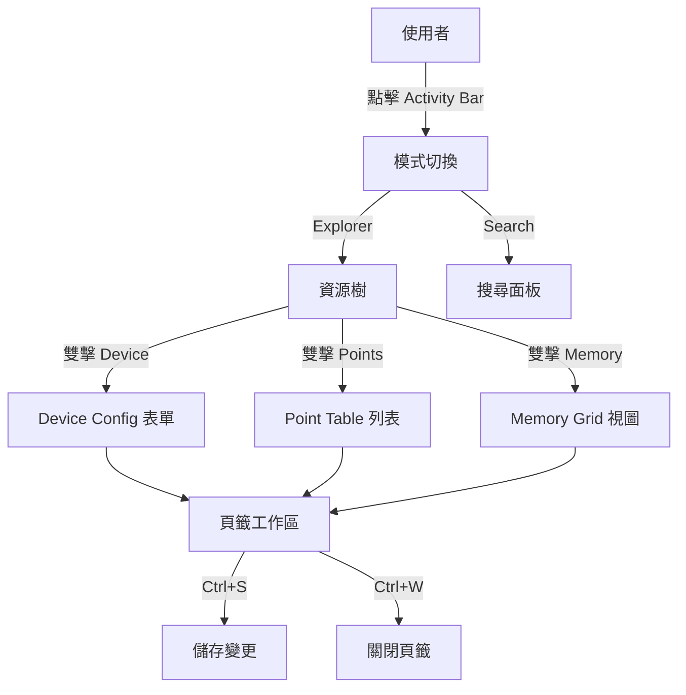
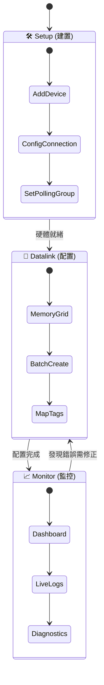
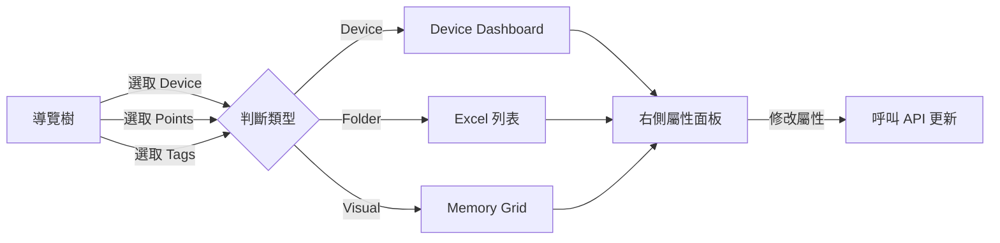

# 終極全功能整合方案 (True All-in-One Integration Plans)

## Context

目前的 [SmartDashboard](file:///c:/AIProject/go_gateway/frontend/src/pages/datalink/SmartDashboard.tsx#14-224) 雖然優化了「點位配置」流程（Memory Grid），但尚未整合整個系統的 CRUD 與管理功能（如 Devices, PollingGroups, Tags, Mappings, Settings）。本文件提出三種架構方案，旨在打造一個**真正的 Single Page Application (IDE)**，讓使用者**永遠不需要離開這個頁面**就能完成所有工作。

---

## Option A: The "VS Code" IDE Model (多頁籤工作區)

模仿 VS Code 的架構，將「資源管理器」與「編輯區」分離。核心概念是**多工處理**與**無限擴充**。

### 架構設計

*   **Left Sidebar (Project Explorer)**: 樹狀結構列出所有資源類型。
*   **Main Area (Tabbed Workspace)**: 支援多頁籤開啟不同類型的編輯器。
*   **Bottom Panel (Output/Terminal)**: 全域日誌、連線診斷。
*   **Activity Bar (Far Left)**: 切換 Explorer, Search, Git (History), Debug 等大模組。

### 運作流程圖

### 詳細規格

1.  **資源樹結構**：
    *   [Devices/](file:///c:/AIProject/go_gateway/internal/datalink/api/router.go#169-180): 所有設備節點。
    *   [PollingGroups/](file:///c:/AIProject/go_gateway/internal/datalink/point/service.go#348-356): 採集群組設定。
    *   [Tags/](file:///c:/AIProject/go_gateway/internal/datalink/api/router.go#344-355): 系統標籤與全域標籤。
    *   `Database/`: 資料庫映射與連線設定。
2.  **編輯器類型**：
    *   **Form Editor**: 用於單一資源設定 (`DeviceOnboarding`, [Settings](file:///c:/AIProject/go_gateway/frontend/src/types/datalink.ts#276-283))。
    *   **Table Editor**: 用於批量資料編輯 ([PointsPage](file:///c:/AIProject/go_gateway/frontend/src/pages/datalink/PointsPage.tsx#18-242), `TagsPage`)，支援篩選/排序。
    *   **Visual Editor**: 圖形化介面 ([MemoryGrid](file:///c:/AIProject/go_gateway/frontend/src/components/datalink/MemoryGrid.tsx#26-116), `MappingWizard`)。
    *   **Text Editor**: JSON/YAML 設定檔直接編輯。

### 優缺點分析

| 優點 | 缺點 |
| :--- | :--- |
| **無限擴充性**：新增功能只需實作新的 Editor，完全不影響佈局。 | **實作複雜度高**：需實作完整的 Tab Manager 與狀態保留機制。 |
| **高密度資訊**：適合重度使用者，可同時開啟多個視窗對照。 | **學習曲線**：對非開發者來說，可能覺得介面過於複雜。 |
| **符合 IDE 直覺**：如果你會用 VS Code，你就會用這個。 | **手機端難以適配**：基本上完全放棄行動端體驗。 |

---

## Option B: The "Perspective" Model (情境切換模式)

類似 Adobe 軟體或 Eclipse，透過頂部「工作模式」切換佈局。將功能依「工程階段」分類，降低單一畫面的認知負載。

### 架構設計

*   **Global Header**: 模式切換器 (Setup / Datalink / Monitor)。
*   **Context**: 每個模式有獨立的 Sidebar 與 Toolbar。
*   **Workflow**: 這是線性的工作流程，引導使用者一步步完成設定。

### 運作流程圖

### 詳細規格

1.  **模式定義**：
    *   **Setup Mode**: 管理 [Devices](file:///c:/AIProject/go_gateway/internal/datalink/api/router.go#169-180), [PollingGroups](file:///c:/AIProject/go_gateway/internal/datalink/point/service.go#348-356), `Connections`。UI 為列表與表單。
    *   **Datalink Mode**: 管理 [Points](file:///c:/AIProject/go_gateway/frontend/src/components/datalink/wizard/steps/PointStep.tsx#38-49), [Mappings](file:///c:/AIProject/go_gateway/internal/datalink/api/router.go#408-419), [Tags](file:///c:/AIProject/go_gateway/internal/datalink/api/router.go#344-355)。UI 為 Memory Grid 與 Mapping Matrix。
    *   **Monitor Mode**: 查看即時數值、通訊狀態、系統日誌。UI 為儀表板與圖表。
2.  **狀態隔離**：
    *   切換模式時，UI 會完全重繪。

### 優缺點分析

| 優點 | 缺點 |
| :--- | :--- |
| **專注力高**：每個階段只顯示相關工具，減少干擾。 | **上下文切換成本**：如果在監控時發現設定錯了，需切換模式才能修改。 |
| **流程引導**：自然的「左到右」工作流 (硬體 -> 軟體 -> 運行)。 | **全域概覽感弱**：難以一眼看到整個系統的關聯性。 |
| **介面簡潔**：畫面永遠不會太原本擁擠。 | |

---

## Option C: The "Master-Detail" Unified View (三欄萬能視窗)

極致的三欄式佈局，中間欄位根據左側選擇的「物件類型」動態改變視圖 (Polymorphic View)。強調「所見即所得」。

### 架構設計

*   **Left (Shared Navigation)**: 混合導覽樹，包含所有類型的物件。
*   **Middle (Dynamic Workspace)**: 根據左側選取內容，動態渲染對應的組件 (Grid / List / Form)。
*   **Right (Inspector)**: 屬性面板，永遠顯示當前選取物件的詳細設定。

### 運作流程圖

### 詳細規格

1.  **混合導覽樹**：
    *   Root: [Devices](file:///c:/AIProject/go_gateway/internal/datalink/api/router.go#169-180), `Tables`, [System](file:///c:/AIProject/go_gateway/frontend/src/types/datalink.ts#276-283)
    *   Context Menu: 每個節點都有獨特的右鍵選單 (Add, Delete, Duplicate)。
2.  **動態視圖 (Polymorphism)**：
    *   選取 Root 節點 -> 顯示 **Summary Dashboard**。
    *   選取 Collection 節點 (如 "All Points") -> 顯示 **Data Grid** (Ag-Grid)。
    *   選取 Single 節點 -> 顯示 **Detail View**。
3.  **無模態窗設計 (Modeless)**：
    *   所有編輯都在右側 Inspector 或中間區直接進行，盡量不跳出 Modal。

### 優缺點分析

| 優點 | 缺點 |
| :--- | :--- |
| **操作直觀**：符合 "Everything is an Object" 的邏輯，點哪改哪。 | **中間區域複雜**：需處理多種 UI 類型的轉換與狀態保留。 |
| **快速跳轉**：所有資源都在同一棵樹上，切換極快。 | **空間限制**：若屬性太多，右側面板可能不夠放。 |
| **現代感強**：類似 Notion 或現代 SaaS 的操作體驗。 | |

---

## 比較總結

| 特性 | Option A (VS Code) | Option B (Perspective) | Option C (Master-Detail) |
| :--- | :--- | :--- | :--- |
| **核心理念** | 編輯器 (Editor) | 工作流 (Workflow) | 物件瀏覽器 (Object Browser) |
| **多工能力** | ⭐⭐⭐ (多頁籤) | ⭐ (單一視圖) | ⭐⭐ (快速切換) |
| **學習曲線** | 高 | 低 | 中 |
| **適合場景** | 複雜配置、重度開發者 | 標準流程、一般工程師 | 快速查看、管理員 |
| **開發成本** | 高 (Tab System) | 中 (Layout Switching) | 高 (Dynamic Components) |

**建議**：若要追求極致的 "IDE" 體驗與整合度，**Option A** 是最佳解；若希望介面現代化且易於上手，**Option C** 是平衡點。
