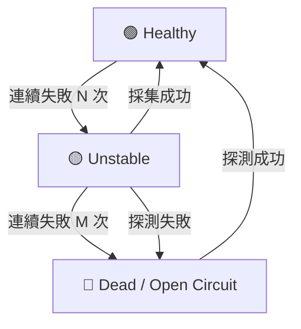

# p1-implement-circuit-breaker 設計文件

## 1. 狀態機設計 (State Machine)

為每個設備引入三種健康狀態：

- **Healthy (Closed Circuit)**: 正常採集模式 (例如 100ms/次)。
- **Unstable (Half-Open)**: 採集偶發失敗，降頻採集 (例如 1s/次)，並記錄錯誤率。
- **Dead (Open Circuit)**: 熔斷狀態，停止常規採集，僅執行「背景探測」(Background Partition) (例如 30s/次)。

## 2. 元件架構

### 2.1 DeviceHealthProfiler (新增)

負責收集每個設備的執行結果。

- `RecordSuccess(duration)`
- `RecordFailure(error)`
- `GetStats()`: 回傳 P99 Latency, Error Rate。

### 2.2 AdaptiveScheduler (修改)

在 `collection-scheduler` 中整合熔斷邏輯。

- 在封包發送前，先檢查 `CircuitBreaker.AllowRequest()`。
- 若不允許，直接回傳 `ErrCircuitOpen` 並跳過該次採集任務。

### 2.3 BackgroundProber (新增)

專門負責對 `Dead` 狀態的設備發送輕量級心跳包（如 Modbus 0x03 Read 1 Register）。

- 成功後觸發 `CircuitBreaker.Reset()`。

## 3. 關鍵演算法

### 失敗計數器 (Windowed Counter)

使用滑動視窗 (Sliding Window) 統計最近 X 次請求的失敗率，而非單純的連續計數，以容忍偶發的網路抖動。

## 4. 權衡取捨

| 方案       | 優點     | 缺點            | 決策                    |
| ---------- | -------- | --------------- | ----------------------- |
| 簡單計數器 | 實作容易 | 對抖動敏感      | **採用滑動視窗**        |
| 同步探測   | 邏輯簡單 | 仍會阻塞 Worker | **採用獨立探測 Worker** |

## 5. 監控指標 (Metrics)

新增 Prometheus/OpenTelemetry 指標：

- `device_circuit_state{device_id}`: 0=Healthy, 1=Unstable, 2=Dead
- `device_error_rate_1m`: 最近一分鐘錯誤率
