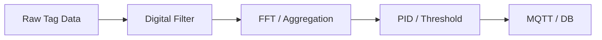

# p4-integrate-edge-computing 設計文件

## 1. 架構：Compute Pipeline

採用類似 Stream Processing 的 Pipeline 架構：



## 2. 核心演算法模組 (lib/algorithms)

參考 Hsl `Algorithms` 命名空間，移植/實作以下 Go 版本演算法：

### 2.1 Fourier (FFT)

- 輸入：`[]float64` (時間序列數據)
- 輸出：`[]Complex` (頻譜)
- 應用：振動分析、諧波檢測。

### 2.2 PID (模擬)

- 輸入：`SetPoint`, `ProcessValue`
- 輸出：`ControlOutput`
- 應用：本地閉迴路控制測試、數值模擬。

### 2.3 Filters

- Moving Average (移動平均)
- Kafka-style Streaming Aggregation (時間視窗聚合)

## 3. 配置設計

在 Datalink 中增加 `Processors` 區段：

```yaml
datalink:
  - source: "PLC1.VibrationRaw"
    target: "DB.VibrationSpectrum"
    processors:
      - type: "buffer"
        size: 1024
      - type: "fft"
      - type: "peak_detection"
        keep_top: 3
```

## 4. 權衡取捨

| 項目     | 選項                                      | 決策                                              |
| -------- | ----------------------------------------- | ------------------------------------------------- |
| 運算位置 | 同步 (Collection Loop) vs 非同步 (Worker) | **非同步**：避免阻塞採集主執行緒                  |
| 數學庫   | 自行實作 vs 使用 GoNum                    | 前期**自行實作**精簡版 (KISS原則)，後期考慮 GoNum |

## 5. 效能保護

為防止 CPU 過載，每個 Pipeline 需設定「最大執行時間」與「丟棄策略 (Drop Policy)」。當運算追不上採集速度時，優先丟棄舊數據。
